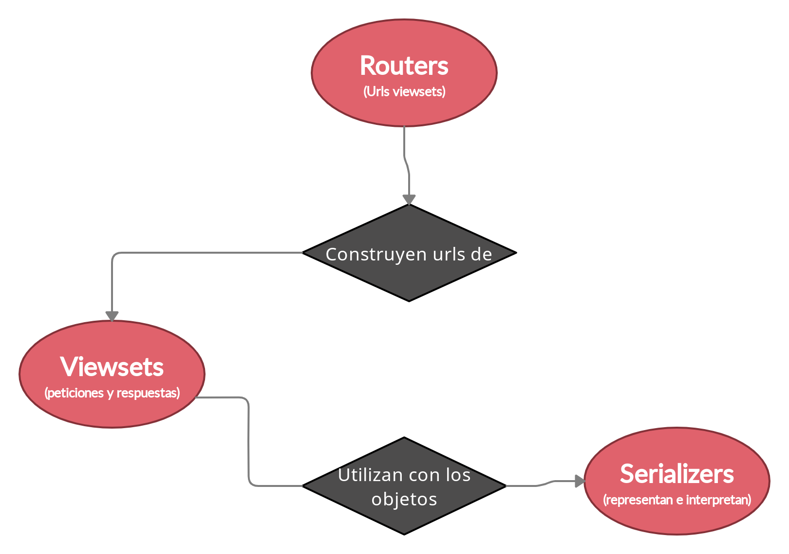

.. Construyendo APIs con Django Rest Framework documentation master file, created by
   sphinx-quickstart on Wed Feb 17 01:02:49 2021.
   You can adapt this file completely to your liking, but it should at least
   contain the root `toctree` directive.

.. This toctree is only to link examples.

.. toctree::
   :glob:
   :hidden:

   *

.. _intro:

===============================================
Construyendo APIs con **Django Rest Framework**
===============================================

.. image:: images/drf_logo.*

.. _sobre-mi:

Sobre mí **Nekmo**
==================

+-----------------------------------+
|                                   |
| .. image:: images/cara.svg        |
|   :width: 200px                   |
|                                   |
| *Django desde versión 1.1 (2009)* |
|                                   |
+-----------------------------------+

.. Buenas, soy Juan José Oyague, más conocido en las redes como Nekmo; y llevo media vida programando en Python,
   usando Django ya desde su versión 1.1. Así que no os puedo engañar...

**Django** + *Django Rest Framework*
====================================

.. ... Me gusta Django, y Django Rest Framework (diapositiva corazón). Y espero conseguir haceros llegar un poco de mi
   pasión por estos dos frameworks, y de los motivos por los que llevo usándolos tanto tiempo. Vale, pero
   antes de llegar a mí Django Rest Framework, llego...

Django
======

.. image:: images/django-white-logo.svg
   :width: 100%

.. revealjs_section::
    :data-background-color: #0c4b33

.. Django. ¿Y qué es exactamente este framework?

Qué es
------

* **Framework web**.
* **Desarrollo rápido** en **Python**.
* Miles de **módulos**.
* Muy **escalable**.
* Gran **soporte**.

.. revealjs_section::
    :data-background-color: #0c4b33

.. Aquí no me puedo parar mucho, pero en resumen, Django es un framework web para el rápido desarrollo en Python, con
   miles de módulos, muy estable y con gran soporte. Seguramente, el más conocido y usado en Python.

Baterías incluidas
------------------

.. revealjs_section::
    :data-background-color: #0c4b33

.. image:: images/batteries-included.*
   :width: 100%

.. Y al igual que Python, tiene baterías incluidas para todo.

Qué incluye
-----------

.. revealjs_section::
    :data-background-color: #0c4b33

* **ORM** para base de datos.
* Administración de **sesiones**.
* Control de **permisos**
* Gestión de **urls**.
* **Middleware**.
* **Caché**.
* envío de **correos**...
* Pero claro, **no API Rest**.

Django Rest Framework
=====================

.. image:: images/drf_logo.*

.. ¿Recordáis que hemos dicho que tiene módulos para todo? Pues Django Rest Framework es uno de esos módulos.
   Se instala en prácticamente en 3 o 4 pasos, y listo para funcionar.

Framework para desarrollar **APIs REST**
----------------------------------------

.. Pero espera... Django Rest Framework es un framework... ¿Y Django también es un framework?

Meta framework
--------------

(diapositiva meme meta).

.. Sí, Django Rest Framework es un framework dentro de otro framework web. Pero aún no saquéis las antorchas.

Antorchas
---------

.. revealjs_section::
    :data-background-color: #000000

**Django Rest Framework** *complementa*
---------------------------------------

.. Django Rest Framework aprovecha todo lo bueno de Django, y lo complementa. Si Django es un pastel

Pastel 1
--------

.. revealjs_section::
    :data-background-color: #badeba
    :data-transition: fade

.. Django Rest Framework es su guinda

Pastel 2
--------

.. revealjs_section::
    :data-background-color: #badeba
    :data-transition: zoom

.. ¿Y nadie quiere una guinda sin pastel, verdad?

Ejemplo web
===========

.. Además, nos construye una API REST muy vistosa y navegable y que nos mostrará el JSON resaltado de nuestros objetos
   de la base de datos.

Formulario
----------

.. No sólo eso, sino que nos construye formularios para crear nuevos objetos. ¿Pero cómo funciona todo esto?

Estructura
==========

.. Si Django Rest Framework me gusta, no es sólo por sus opciones o su modo web, sino porque a diferencia de otros
   módulos que hacen lo mismo, entiende perfectamente la filosofía de Django, y ello se ve en su estructura base.

Serializers
===========

**¿Qué son?**

.. Vale, empecemos por los serializers. ¿Y qué hacen los serializers?

Los serializers, serializan
---------------------------

*Nekmo, 2021.*

.. Los serializers, serializan. Juan José Oyague, 2021. Vale, ahora en serio.

Convertir la entrada
--------------------

.. Los serializers, son los responsables de convertir la entrada de datos, vamos, lo que mete el usuario a través de la
   API, en un objeto en Python, que normalmente servirá para crear o actualizar un objeto en la base de datos

Convertir la salida
-------------------

.. También hacen lo mismo pero a la inversa: convierten el objeto a una salida compatible, para que nos entendamos, un
   diccionario, y devolverlo al usuario.

Viewsets
========
Lógica encargada de procesar las peticiones de la API para **trabajar con los objetos** para:

* Crearlos
* Listarlos
* crearlos
* Borrarlos...

.. Los viewsets en cambio, son la lógica encargada de devolver tus objetos, a través de la API, crearlos,
   listarlos, etc.

Ejemplo viewset
---------------
(ejemplo código: https://www.django-rest-framework.org/api-guide/viewsets/ ).

.. Por ejemplo, el viewset ``UserViewSet`` tendrá las siguientes acciones para trabajar con los usuarios: listar, crear,
   obtener y eliminar.

Parsers y renderers
-------------------

También se encarga de definir:

* Los **parsers** (leen e interpretan la petición).
* Los **renderers** (devuelven al usuario la respuesta).

Algunos **formatos**: *json* (por defecto), *xml*, *yaml*, *csv*...

.. El viewset no sólo se encarga de esto: también define los llamados *parsers* que son las formas de leer la
   información del usuario para aceptar json, xml, entre otros, y los *renders*, para devolver los datos según pueda
   quererlo el usuario.

Otras opciones viewsets
-----------------------

* **Filtrado y paginación** en listados.
* **Permisos y autenticación**.
* **Caché respuesta**
* **Documentación**
* ... y mucho más.

.. No sólo esto, sino que se encargan de muchas cosas más, como filtrado y paginación* en los listados,
   *permisos y autenticación*, *caché*, *documentación* y mucho más. Vale, y hasta aquí la mitad de la presentación.

Mitad presentación
==================
(diapositiva de aplausos)

.. Lo que queda por suerte ya es más fácil. Pasemos a los routers.

Routers
=======

.. Los *routers* son la parte más sencilla de explicar: se encargan de registrar los viewsets y ponerles un nombre,
   para que sea posible acceder a ellos por una url. ¿No es genial acabar con la parte más fácil?

Urls
----

.. Después sólo queda registrarlos en el ``urls.py`` de Django, igual que con cualquier otra app. Así de fácil.

En resumen
==========

* **Serializers**: representan e interpretan los datos.
* **Viewsets**: gestionan las peticiones y devuelven la respuesta.
* **Routers**: corresponde a las urls que se utilizarán

.. Así pues, en resumen tenemos: serializers que representan e interpretan los datos, viewsets que gestionan las
   peticiones, y routers que corresponde a las urls que se utilizarán.

¿Y no podríamos reducirlo?
==========================
(esquema serializers, viewsets, routers)

.. Pero claro, alguno pensará... ¡Esas son muchas clases y muchas cosas! ¿No podría estar todo junto? A mí también me
   lo pareció al principio. Por ejemplo, ¿por qué no juntar los serializers y los viewsets?

Heredar serializers
===================

.. El motivo por el que no se puede , es que puedes heredar de tu serializer para crear uno en mas detalle.

Condicionar serializer
----------------------

.. Y devolver un serializer u otro dependiendo de si lo pones en un listado o pides sólo uno, por ejemplo. Así
   ahorras datos. ¿No es genial?

Anidar serializers
------------------

.. Y por si fuera poco, puedes reutilizar tus serializers para usarlos en otros serializers, anidados. Esto es
   lo que se llama *nested serializers*

Otros módulos
=============

* `djoser <https://github.com/sunscrapers/djoser>`_ (Registro y autenticación usuarios).
* `django-oauth-toolkit <https://github.com/jazzband/django-oauth-toolkit>`_ (OAuth2).
* `drf-yasg <https://github.com/axnsan12/drf-yasg/>`_ (Swagger).
* `drf-nested-routers <https://github.com/alanjds/drf-nested-routers>`_ (Routers anidados)
* `rest-pandas <https://github.com/wq/django-rest-pandas>`_ (Excel, CSV y SVG renderers).
* `drf-extensions <https://github.com/chibisov/drf-extensions>`_ (extensiones varias).

.. La gente de Django Rest Framework ha pensado en muchas de estas cosas, pero por si fuera poco, cuentas con cientos
   de módulos de terceros, como por ejemplo (listar ejemplos).

Demo
====

.. Aunque hay módulos para swagger, documentación adicional y más, Django Rest Framework ya incluye una interfaz
   navegable muy avanzada y fácil de usar. Vamos a ver un ejemplo con, por ejemplo, ...

Pikachu
-------
(diapositiva pikachu).

.. Pokémon. Porque, ¿por qué no?

¡Muchas gracias!
================

.. Y hasta aquí la presentación. Espero que no se haya alargado de más.

Referencias
-----------

* `Django Tutorial <https://docs.djangoproject.com/en/3.1/intro/tutorial01/>`_.
* `Django Rest Framework Tutorial <https://www.django-rest-framework.org/tutorial/quickstart/>`_.
* `Awesome Django Rest Framework <https://github.com/nioperas06/awesome-django-rest-framework>`_.

.. Tenéis enlaces a Django, Django Rest Framework y un listado de módulos geniales para este último.

¿Y la presentación?
-------------------
Vuelve a verla, prueba la demo y mira el código fuente en:

`github:Nekmo/django-rest-framework-presentacion <https://github.com/Nekmo/django-rest-framework-presentacion>`_

.. Además de a la presentación, por si queréis volver a verla.

Contactar
---------

* **Sitio web:** `contacto@nekmo.com <mailto:contacto@nekmo.com>`_
* **Email:** `contacto@nekmo.com <mailto:contacto@nekmo.com>`_
* **Twitter:** `@nekmocom <https://twitter.com/nekmocom>`_
* **Telegram:** `@nekmo <https://t.me/nekmo>`_
* **Jabber:** `nekmo@nekmo.org <xmpp://nekmo@nekmo.org>`_

.. Finalmente, también tenéis mi sitio web (ejem ejem spam) en esta diapositiva. Y también mi email. Y Twitter.
   Aunque apenas escriba en Twitter. Y ante todo, ¡muchas gracias a todos!
